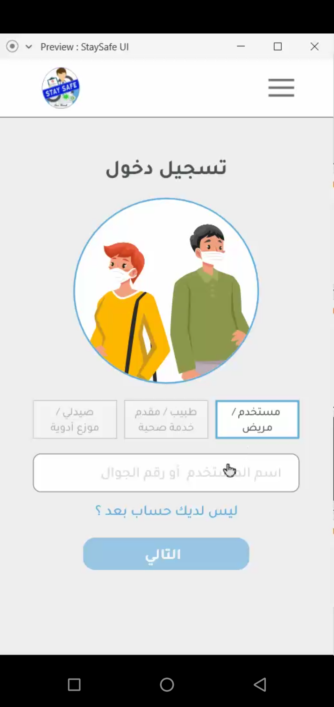
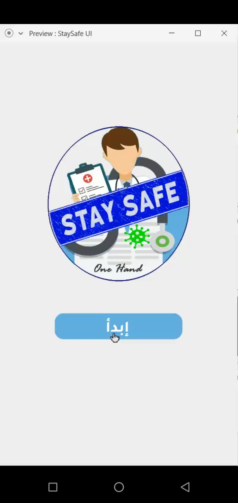

# StaySafeApp
 This App is an android application has developed in Hamathon Competition 2020. It is for making online consultations and appointments specially during coronavirus epidemic.
.

 

this app has been developed with the following team members : 
1- Abdulfattah Esmail Ba Alawi  ( Republic Of Yemen )
2- Ahmed Al-hassani ( Republic Of Yemen )
3- Hailah Alharthi ( Saudi Arabia)
4- Jawaher Alharthi ( Saudi Arabia)
5- Maram AlBalawi ( Saudi Arabia)

